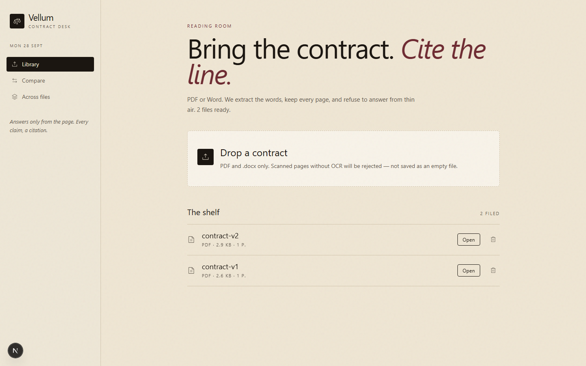
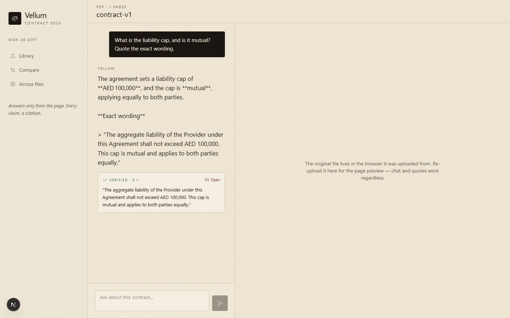
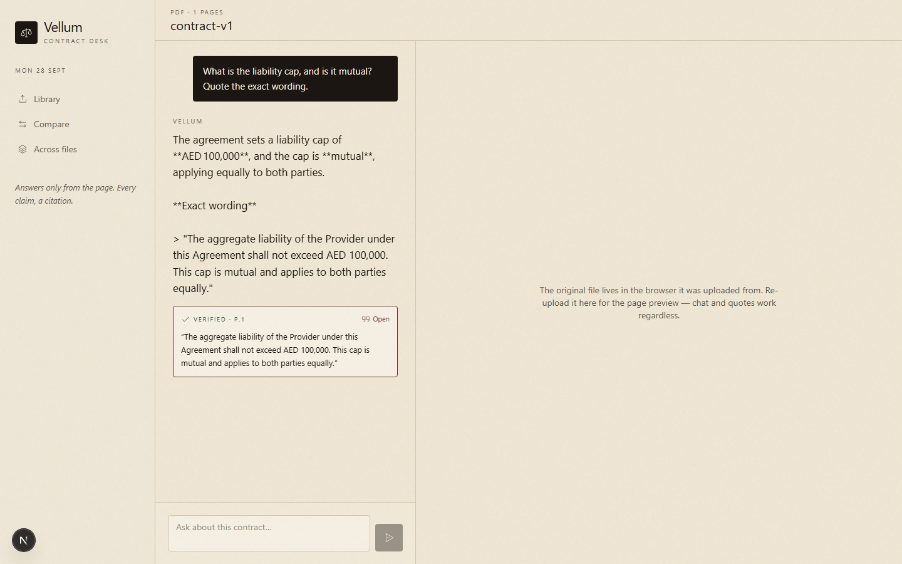
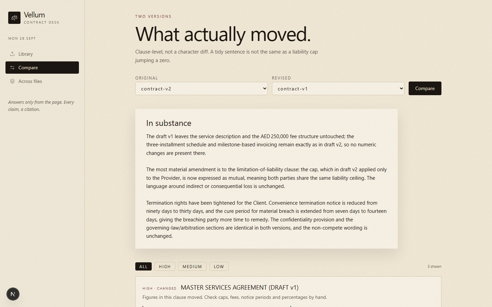

# Vellum

A contract desk: upload a PDF or Word file, ask questions, and get answers that only stand if the quote can be found in the document. Click a citation and the passage is highlighted on the page.

No accounts. One user. Built for the engineering assignment (Parts A, B, and C option 2).

Live: _(App Hosting rollout URL goes here after `firebase apphosting:backends:create`)_ · Repo: https://github.com/Krish-1507/vellum

## What it does

- **Upload & library** — PDF and `.docx` only. Other types are rejected with a clear message. Processing status streams while text is extracted. Scanned PDFs with no selectable text are refused instead of being saved empty.
- **Chat** — Questions stream token by token with a live tool-activity feed ("Searching for liability cap…"). Stop mid-answer and keep what was written. History is stored per document.
- **Verified quotes** — Every citation is searched in the extracted text with whitespace folding. Invented or paraphrased quotes are dropped, never shown as genuine. Click a quote to open the passage highlighted on the page.
- **Large files** — A 150-page contract is chunked. The model never receives the whole file; an agent loop looks things up with `search_document`, `get_section`, `list_clauses`, `get_pages` (max 6 rounds). If it only read part of the file, the UI warns that absence of a clause is not certain.
- **Citation highlighting** — Glyph-level mapping on PDFs, text-range mapping on Word exports. Quotes wrapping lines, crossing page breaks, or appearing more than once are handled.
- **Multi-document questions** — Select several files, ask once. One comparative answer; each quote names its source and is verified against that file only.
- **Comparison** — Two versions, clause-level diffs, a plain-language substance summary (rewording is not treated as a commercial change), filter by high / medium / low significance.
- **Part C: agentic research** — real multi-round tool loop, live status, hard round cap, malformed tool calls handled, quotes still verified on the final answer.

## Screenshots









## How to run locally

Prerequisites: Node 22+, npm, Java 17+ (for the Firestore emulator).

```bash
npm install
cp .env.example .env   # then put your GROQ_API_KEY in .env
npm run db:emulator     # terminal 1: local Firestore on :8080
npm run dev             # terminal 2: http://localhost:3000
```

No database install, no migrations, no Postgres. Data lives in Firestore (emulator locally, `vellum-project` in production); original file bytes stay in the browser's IndexedDB, so the server is fully stateless.

Sample contracts for trying everything (chat, multi-ask, compare):

```bash
node scripts/make-sample-pdf.mjs   # writes data/samples/contract-v1.pdf + contract-v2.pdf
```

End-to-end smoke test (upload → process → agentic chat → compare, needs dev server + keys):

```bash
node scripts/e2e-check.mjs
```

### Environment

| Variable | Purpose |
| --- | --- |
| `FIREBASE_PROJECT_ID` | Firestore project (`vellum-project` in production) |
| `FIRESTORE_EMULATOR_HOST` | Set to `127.0.0.1:8080` for local dev; unset in production |
| `GROQ_API_KEY` | Recommended AI key (free tier). Get one at https://console.groq.com |
| `AI_API_KEY` | Alternative OpenAI-compatible key |
| `AI_BASE_URL` | Override (Groq default `https://api.groq.com/openai/v1` when only `GROQ_API_KEY` is set) |
| `AI_MODEL` | Override (Groq default `openai/gpt-oss-120b`: 131k context, tool use, $0.15/$0.60 per 1M) |
| `FIREBASE_STORAGE_BUCKET` | Optional. When set, uploads go to Firebase Storage; otherwise local disk |

Do not commit keys (`.env` is gitignored). A `GROQ_API_KEY` pointed at OpenAI's base URL (or vice versa) fails fast with a plain message instead of a cryptic 401.

## Deploy (free tier)

- **Hosting** — Firebase App Hosting (`apphosting.yaml` at root, tuned to stay free: 0–2 instances, 1 CPU, 1 GB). Create the backend once and connect the `Krish-1507/vellum` repo:
  `firebase apphosting:backends:create --project vellum-project`
- **Secrets** (never committed):
  `firebase apphosting:secrets:set GROQ_API_KEY --project vellum-project`
  (`FIREBASE_PROJECT_ID` is baked into the environment; no database URL needed.)
- **Database** — Firestore (Native mode, `asia-south1`, default-deny `firestore.rules`, deployed). All queries are key-based; 150-page retrieval costs a few hundred reads per question, comfortably inside the 50k/day free quota. Originals stay in browser IndexedDB, so there is nothing else to host.
- **Uploads** — Firebase Cloud Storage (5 GB free, `storage.rules` default-deny; server uses Admin SDK). One click "Get started" in the Storage console, then set the bucket secret above.

## What is finished

- Parts A1–A4
- Parts B5–B7
- Part C option 2 (agentic document research), including live tool activity, round cap, and quote verification on the final answer
- Clause detection used by `list_clauses`
- Comparison significance ranking
- Production storage path (Firebase Storage with local-disk fallback)

## What is not

- Option 1 (tracked-change redlining) was not chosen
- Optional extras (anonymise, embeddings, export, Arabic UI, background job recovery, voice) are not in this build
- Demo video / deployed URL are submission artefacts, not part of this repository

## Architecture notes

See `NOTE.md` for quote verification, large-document strategy, and the Part C write-up.
